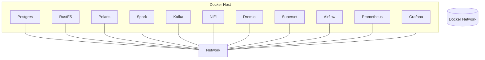

\# Deployment Architecture

\## Overview

All platform services are deployed as Docker containers connected through a shared Docker network.

\## Containers

| Container | Purpose |

|------------|----------|

| PostgreSQL | Metadata database |

| RustFS | Object storage |

| Apache Polaris | Iceberg REST Catalog |

| Apache Spark | Processing engine |

| Apache Kafka | Streaming platform |

| Apache NiFi | Data ingestion |

| Dremio OSS | SQL engine |

| Apache Superset | BI dashboards |

| Apache Airflow | Workflow orchestration |

| Prometheus | Metrics |

| Grafana | Monitoring |

\## Deployment Diagram

