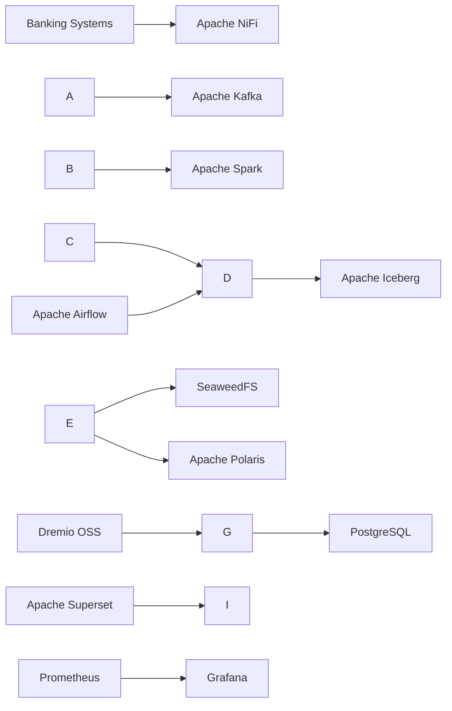

\# Logical Architecture

\## Overview

The Banking Lakehouse is designed as a layered data platform where each component has a well-defined responsibility. The architecture separates ingestion, processing, storage, governance, analytics, orchestration, and monitoring.

\## Architecture Layers

| Layer | Components |

|--------|------------|

| Data Sources | Core Banking, CRM, Payment Systems, ATM, REST APIs |

| Ingestion | Apache NiFi |

| Streaming | Apache Kafka |

| Processing | Apache Spark |

| Storage | Apache Iceberg + SeaweedFS |

| Catalog | Apache Polaris |

| Metadata | PostgreSQL |

| Analytics | Dremio OSS |

| Visualization | Apache Superset |

| Orchestration | Apache Airflow |

| Monitoring | Prometheus + Grafana |

\## Service Interaction

