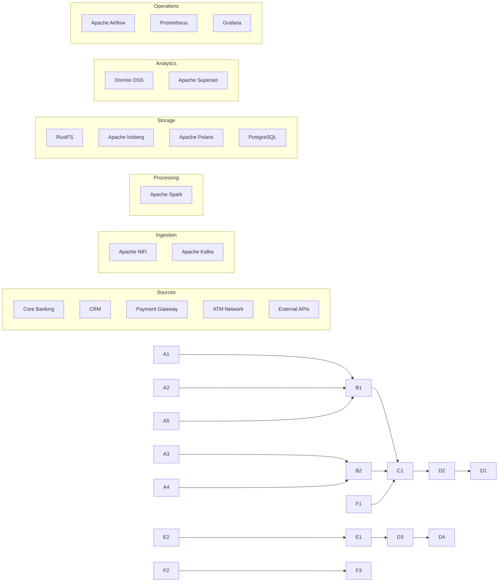

\# Banking Lakehouse Solution Design Document (SDD)


\---


\## Executive Summary


The Banking Lakehouse project aims to design and implement an enterprise-grade, open-source data platform capable of ingesting, processing, governing, and analyzing banking data at scale.


The solution adopts the modern Lakehouse architecture by combining the scalability of a data lake with the reliability and performance of a data warehouse. The platform is designed around the Medallion Architecture (Bronze, Silver, and Gold layers) to support incremental data quality improvements, historical versioning, and analytical reporting.


The architecture integrates streaming and batch processing using Apache Kafka and Apache Spark, while Apache Iceberg provides ACID-compliant table management and advanced capabilities such as schema evolution, partition evolution, hidden partitioning, and time travel.


Apache Polaris acts as the centralized Iceberg REST Catalog, providing metadata governance and enabling interoperability between compute engines. RustFS serves as the S3-compatible object storage layer for all Iceberg data files and metadata.


Apache Dremio OSS provides high-performance SQL query capabilities, while Apache Superset delivers interactive dashboards and business intelligence reporting. Workflow orchestration is managed through Apache Airflow, and Apache NiFi enables low-code ingestion of banking data from multiple sources.


The overall solution emphasizes modularity, scalability, security, observability, and cloud portability while remaining fully based on open-source technologies.


\---


\## Document Information


| Field | Value |

|-------|-------|

| Project | Banking Lakehouse |

| Document | Solution Design Document (SDD) |

| Version | 1.0 |

| Status | Draft |

| Author | Jayasri |

| Reviewer | TBD |

| Created Date | July 2026 |

| Last Updated | July 2026 |


\---


\## Revision History


| Version | Date | Author | Description |

|----------|------|--------|-------------|

| 1.0 | July 2026 | Jayasri | Initial Solution Design Document |


\---


\# Table of Contents


1\. Introduction

2\. Business Objectives

3\. Business Requirements

4\. Functional Requirements

5\. Non-Functional Requirements

6\. Solution Overview

7\. Architecture Principles

8\. High-Level Architecture

9\. Component Responsibilities

10\. Data Flow

11\. Technology Stack

12\. Storage Strategy

13\. Security

14\. Deployment Strategy

15\. Monitoring \& Observability

16\. Risks

17\. Future Enhancements

18\. References


\---


\# 1. Introduction


\## 1.1 Background


Banks generate enormous volumes of structured, semi-structured, and streaming data from multiple operational systems, including core banking, payment gateways, ATM networks, mobile banking applications, internet banking portals, customer relationship management systems, fraud detection platforms, and regulatory reporting systems.


Traditionally, these data sources have been processed using Enterprise Data Warehouses (EDW), which provide reliable reporting but often struggle with scalability, flexibility, and the ability to process modern streaming workloads.


Modern banking platforms require an architecture capable of supporting:


\- Real-time fraud detection

\- Customer 360 analytics

\- Regulatory reporting

\- Risk management

\- Anti-Money Laundering (AML)

\- Know Your Customer (KYC)

\- AI and Machine Learning workloads

\- Self-service analytics


The Lakehouse architecture addresses these requirements by combining the scalability of Data Lakes with the reliability, governance, and performance of Data Warehouses.


\---


\## 1.2 Purpose


The purpose of this document is to describe the design and implementation approach for the Banking Lakehouse platform.


This document serves as the primary technical reference for developers, architects, DevOps engineers, data engineers, testers, and project stakeholders.


\---


\## 1.3 Objectives


The primary objectives of the Banking Lakehouse are:


\- Build a fully open-source Lakehouse platform.

\- Support both batch and real-time data ingestion.

\- Store data using Apache Iceberg tables.

\- Enable ACID transactions.

\- Support schema evolution.

\- Support time travel.

\- Centralize metadata using Apache Polaris.

\- Store data in RustFS object storage.

\- Provide interactive SQL analytics using Dremio OSS.

\- Build dashboards using Apache Superset.

\- Orchestrate workflows using Apache Airflow.

\- Support scalable Spark processing.


\---


\## 1.4 Intended Audience


This document is intended for:


| Role | Responsibility |

|------|----------------|

| Solution Architects | Overall platform design |

| Data Engineers | Pipeline implementation |

| Platform Engineers | Infrastructure deployment |

| DevOps Engineers | CI/CD and automation |

| Data Analysts | Data consumption |

| BI Developers | Dashboard development |

| Project Managers | Project governance |


\---


\## 1.5 Assumptions


The following assumptions have been made:


\- The platform will initially be deployed using Docker Compose.

\- All technologies will be open source.

\- Object storage will be provided by RustFS.

\- Apache Polaris will serve as the Iceberg REST Catalog.

\- PostgreSQL will store metadata.

\- Spark will perform batch and streaming processing.

\- Dremio OSS will provide SQL query capabilities.

\- Authentication and enterprise security integrations are outside the scope of the initial implementation.


\---


\## 1.6 Scope


This document covers:


\- Overall solution architecture

\- Technology selection

\- Data flow

\- Storage architecture

\- Metadata management

\- Processing architecture

\- Deployment architecture

\- Security considerations

\- Monitoring strategy


This document does not cover:


\- Kubernetes deployment

\- Disaster Recovery

\- Multi-region deployment

\- Enterprise Identity Management

\- Cloud-specific deployment


\---


\# 2. Business Objectives


The Banking Lakehouse is designed to modernize banking data management by replacing traditional siloed architectures with a unified, scalable, and governed data platform.


\## Business Goals


\- Create a single source of truth for enterprise banking data.

\- Enable real-time analytics for fraud detection and risk monitoring.

\- Reduce data duplication across analytical systems.

\- Improve data governance through centralized metadata management.

\- Accelerate report generation for regulatory compliance.

\- Support self-service analytics for business users.

\- Enable AI and Machine Learning use cases.

\- Improve operational efficiency through automation.

\- Build a cloud-portable architecture using open-source technologies.


\## Success Criteria


The implementation will be considered successful if it:


\- Supports batch and streaming workloads.

\- Stores all analytical datasets in Apache Iceberg format.

\- Supports schema evolution and time travel.

\- Provides SQL analytics through Dremio OSS.

\- Enables dashboard creation in Apache Superset.

\- Supports orchestration through Apache Airflow.

\- Provides scalable object storage using RustFS.


\---


\# 3. Business Requirements


The Banking Lakehouse must satisfy the following business requirements.


| ID | Requirement | Priority |

|----|-------------|----------|

| BR-001 | Centralized enterprise data platform | High |

| BR-002 | Batch data ingestion | High |

| BR-003 | Real-time streaming ingestion | High |

| BR-004 | Data governance | High |

| BR-005 | Historical data retention | High |

| BR-006 | Regulatory reporting | High |

| BR-007 | Self-service analytics | Medium |

| BR-008 | AI/ML readiness | Medium |

| BR-009 | Cost optimization using open source | High |

| BR-010 | Cloud portability | Medium |


\---


\# 4. Functional Requirements


The Banking Lakehouse platform shall provide the following functional capabilities.


| ID | Requirement | Description | Priority |

|----|-------------|-------------|----------|

| FR-001 | Batch Data Ingestion | Ingest structured banking datasets from files, databases, and APIs. | High |

| FR-002 | Streaming Data Ingestion | Consume real-time events using Apache Kafka. | High |

| FR-003 | Data Processing | Transform raw data into curated datasets using Apache Spark. | High |

| FR-004 | Data Storage | Store datasets in Apache Iceberg tables within RustFS object storage. | High |

| FR-005 | Metadata Management | Manage Iceberg metadata through Apache Polaris REST Catalog. | High |

| FR-006 | SQL Query Engine | Query datasets using Dremio OSS. | High |

| FR-007 | Dashboarding | Visualize curated datasets using Apache Superset. | Medium |

| FR-008 | Workflow Orchestration | Schedule and monitor pipelines using Apache Airflow. | High |

| FR-009 | Data Governance | Maintain schema versions and metadata lineage. | High |

| FR-010 | Monitoring | Monitor platform health using Prometheus and Grafana. | Medium |

| FR-011 | Data Versioning | Support Iceberg snapshots and rollback capabilities. | High |

| FR-012 | Schema Evolution | Support adding, renaming, and removing columns without downtime. | High |


\## Functional Workflow


The system shall support the following end-to-end workflow:


1\. Collect banking data from multiple source systems.

2\. Ingest data using Apache NiFi or Kafka.

3\. Process data using Apache Spark.

4\. Store processed data in Iceberg tables.

5\. Register metadata with Apache Polaris.

6\. Persist files in RustFS.

7\. Query data using Dremio OSS.

8\. Visualize insights using Apache Superset.

9\. Schedule recurring jobs using Apache Airflow.

10\. Monitor the platform using Prometheus and Grafana.


\---


\# 5. Non-Functional Requirements


The Banking Lakehouse must satisfy the following quality attributes.


| Category | Requirement |

|----------|-------------|

| Scalability | Support horizontal scaling for processing and storage. |

| Availability | Services should be restartable without data loss. |

| Reliability | Ensure ACID-compliant data operations using Apache Iceberg. |

| Performance | Process millions of banking records efficiently. |

| Security | Support authentication and authorization in future releases. |

| Maintainability | Use modular microservice-based architecture. |

| Portability | Deploy consistently using Docker Compose. |

| Extensibility | Allow new processing engines to be integrated easily. |

| Interoperability | Use open standards including Iceberg REST Catalog APIs. |

| Observability | Provide metrics, dashboards, and centralized logging. |

| Disaster Recovery | Support metadata backup and object storage recovery. |

| Cost Optimization | Use only open-source technologies. |


\## Quality Goals


The platform should:


\- Be cloud portable.

\- Minimize vendor lock-in.

\- Support hybrid deployments.

\- Enable CI/CD automation.

\- Support future Kubernetes migration.


\---


\# 6. Solution Overview


The Banking Lakehouse is designed as a modular, open-source analytics platform implementing the Medallion Architecture.


The platform separates responsibilities into multiple logical layers:


1\. Data Sources

2\. Data Ingestion

3\. Streaming Platform

4\. Data Processing

5\. Metadata Management

6\. Object Storage

7\. SQL Analytics

8\. Business Intelligence

9\. Workflow Orchestration

10\. Monitoring


Each component communicates through well-defined APIs and open standards, enabling independent scaling and simplified maintenance.


The architecture is designed to support both batch and streaming data processing while maintaining a unified analytical storage layer based on Apache Iceberg.


\---


\# 7. Architecture Principles


The Banking Lakehouse follows these architectural principles.


\## Open Source First


All components are based on mature open-source technologies to reduce licensing costs and avoid vendor lock-in.


\## Lakehouse Architecture


A unified storage architecture combining the flexibility of a data lake with the reliability of a data warehouse.


\## Medallion Data Model


Data progresses through Bronze, Silver, and Gold layers, improving quality and business value at each stage.


\## Separation of Compute and Storage


Apache Spark performs compute-intensive operations while RustFS provides scalable object storage.


\## Metadata Governance


Apache Polaris centralizes metadata management using the Iceberg REST Catalog specification.


\## Modular Design


Each service is independently deployable, replaceable, and scalable.


\## API-Driven Integration


Components communicate through REST APIs, JDBC, SQL, Kafka protocols, and the Iceberg REST Catalog.


\## Cloud Portability


The platform can be migrated from Docker Compose to Kubernetes or cloud-native services with minimal architectural changes.


\---


\# 8. High-Level Architecture


\## Architecture Overview


The Banking Lakehouse follows a layered architecture that separates data ingestion, processing, storage, governance, analytics, orchestration, and monitoring into independent services.


The platform is composed entirely of open-source technologies and follows the Medallion architecture (Bronze, Silver, Gold) using Apache Iceberg as the table format.


\## Architecture Layers


| Layer | Components |

|--------|------------|

| Data Sources | Banking Databases, CSV Files, REST APIs, Streaming Events |

| Ingestion | Apache NiFi |

| Streaming | Apache Kafka |

| Processing | Apache Spark |

| Storage | RustFS |

| Table Format | Apache Iceberg |

| Metadata Catalog | Apache Polaris |

| SQL Engine | Dremio OSS |

| BI | Apache Superset |

| Workflow | Apache Airflow |

| Monitoring | Prometheus + Grafana |

| Metadata Database | PostgreSQL |


\## High-Level Architecture Diagram





\---


\# 9. Component Responsibilities


| Component | Purpose | Inputs | Outputs | Dependencies |

|-----------|----------|--------|----------|--------------|

| Apache NiFi | Batch ingestion | Files, APIs | Kafka / Spark | None |

| Apache Kafka | Streaming ingestion | Events | Spark | Zookeeper (or KRaft in future) |

| Apache Spark | Processing engine | Kafka, Files | Iceberg Tables | Polaris |

| Apache Iceberg | Table format | Spark | Versioned Tables | RustFS |

| RustFS | Object Storage | Iceberg Files | Data Objects | None |

| Apache Polaris | Iceberg REST Catalog | Metadata | REST APIs | PostgreSQL |

| PostgreSQL | Metadata Database | Polaris Metadata | Catalog Storage | None |

| Dremio OSS | SQL Analytics | Iceberg Tables | SQL Results | Polaris |

| Apache Superset | Dashboards | Dremio | Visualizations | Dremio |

| Apache Airflow | Workflow Orchestration | DAGs | Scheduled Jobs | Spark |

| Prometheus | Metrics | Services | Metrics | None |

| Grafana | Monitoring | Prometheus | Dashboards | Prometheus |


\---


\# 10. Data Flow


\## End-to-End Processing Flow


1\. Banking systems generate transactional and reference data.

2\. Apache NiFi ingests batch data from files, databases, and REST APIs.

3\. Apache Kafka ingests streaming events such as transactions and payment notifications.

4\. Apache Spark consumes data from both NiFi and Kafka.

5\. Spark validates, cleanses, and transforms data.

6\. Curated datasets are written as Apache Iceberg tables.

7\. Iceberg stores data files in RustFS.

8\. Apache Polaris maintains metadata for Iceberg tables.

9\. PostgreSQL stores Polaris catalog metadata.

10\. Dremio queries Iceberg tables through Polaris.

11\. Apache Superset creates dashboards using Dremio.

12\. Apache Airflow orchestrates scheduled jobs.

13\. Prometheus collects metrics from all platform services.

14\. Grafana visualizes operational metrics and alerts.


\## Medallion Architecture


| Layer | Purpose | Example |

|--------|----------|---------|

| Bronze | Raw data | Raw transaction files |

| Silver | Cleaned and validated data | Standardized customer records |

| Gold | Business-ready datasets | Daily customer balances |


\---


\# 11. Technology Stack


| Layer | Technology | Version | Purpose |

|---------|------------|----------|----------|

| Object Storage | RustFS | Latest Stable | S3-compatible storage |

| Table Format | Apache Iceberg | 1.9.2 | ACID tables |

| Catalog | Apache Polaris | 1.0.x | REST Catalog |

| Metadata DB | PostgreSQL | 16 | Catalog metadata |

| Processing | Apache Spark | 3.5.6 | Batch \& Streaming |

| Streaming | Apache Kafka | 7.5.x (Confluent Platform) | Event streaming |

| Ingestion | Apache NiFi | 2.x | Batch ingestion |

| SQL Engine | Dremio OSS | 26.x | Interactive SQL |

| BI | Apache Superset | Latest Stable | Dashboards |

| Orchestration | Apache Airflow | 3.x | Workflow scheduling |

| Monitoring | Prometheus | Latest Stable | Metrics |

| Visualization | Grafana | Latest Stable | Monitoring dashboards |

| Container Runtime | Docker | 29.x | Local deployment |

| Container Orchestration | Docker Compose | v2 | Service orchestration |


---

# 12. Storage Strategy

## Overview

The Banking Lakehouse adopts a cloud-native object storage architecture based on RustFS.

Apache Iceberg manages all analytical datasets while RustFS stores the underlying data files and metadata files.

Metadata management is centralized through Apache Polaris using PostgreSQL.

## Storage Layers

| Layer | Technology | Purpose |
|---------|------------|----------|
| Bronze | Iceberg + RustFS | Raw landing data |
| Silver | Iceberg + RustFS | Cleansed data |
| Gold | Iceberg + RustFS | Business-ready datasets |

## Storage Components

| Component | Responsibility |
|------------|----------------|
| RustFS | Object Storage |
| Iceberg | Table Format |
| Polaris | Catalog |
| PostgreSQL | Metadata Repository |

## Folder Structure

```
rustfs
│
├── bronze/
│
├── silver/
│
├── gold/
│
└── warehouse/
```

## Iceberg Features

- ACID Transactions
- Schema Evolution
- Hidden Partitioning
- Time Travel
- Snapshot Isolation
- Partition Evolution
- Data Versioning

## Storage Design Decisions

The project uses RustFS because:

- S3 compatible
- Lightweight
- Open Source
- Active development
- Compatible with Iceberg
- Easy Docker deployment

---

# 13. Security

## Current Scope

This project focuses on infrastructure and data engineering capabilities.

Enterprise authentication is outside the scope of Phase 1.

## Current Security Controls

| Layer | Security |
|---------|----------|
| Docker Network | Internal communication |
| PostgreSQL | Username/Password |
| RustFS | Access Key / Secret Key |
| Polaris | Catalog Authentication |
| Dremio | Local Authentication |
| Kafka | PLAINTEXT (Development) |

## Future Enhancements

Future releases may include:

- LDAP
- OAuth2
- OpenID Connect
- Kerberos
- TLS Encryption
- Secrets Management
- Hashicorp Vault
- Apache Ranger

---

# 14. Deployment Strategy

The Banking Lakehouse will be implemented incrementally.

## Phase 1

Repository Foundation

## Phase 2

Storage Layer

- PostgreSQL
- RustFS
- Apache Polaris

## Phase 3

Processing Layer

- Apache Spark
- Apache Iceberg

## Phase 4

Streaming

- Kafka
- Apache NiFi

## Phase 5

Analytics

- Dremio
- Superset

## Phase 6

Workflow

- Airflow

## Phase 7

Monitoring

- Prometheus
- Grafana

## Deployment Model

Development

↓

Docker Compose

↓

Testing

↓

GitHub

↓

Production (Future Kubernetes)

---

# 15. Monitoring & Observability

## Objectives

Provide complete operational visibility across all platform services.

## Monitoring Components

| Tool | Purpose |
|------|----------|
| Prometheus | Metrics Collection |
| Grafana | Dashboards |
| Docker Logs | Container Logs |

## Metrics

The following metrics will be monitored:

- CPU
- Memory
- Disk Usage
- Kafka Lag
- Spark Jobs
- Iceberg Tables
- RustFS Storage
- PostgreSQL Connections
- Dremio Queries
- Airflow DAG Status

## Dashboards

The platform will provide dashboards for:

- Infrastructure
- Kafka
- Spark
- PostgreSQL
- RustFS
- Dremio
- Airflow

## Alerting

Future releases will support:

- Email Alerts
- Slack Notifications
- Microsoft Teams

##Logical Architecture
                    Banking Sources
                           │
                           ▼
                    Apache NiFi
                           │
                ┌──────────┴─────────┐
                ▼                    ▼
          Apache Kafka        Batch Files
                │                    │
                └──────────┬─────────┘
                           ▼
                     Apache Spark
                           │
                           ▼
                    Apache Iceberg
                           │
          ┌────────────────┴───────────────┐
          ▼                               ▼
     Apache Polaris                 RustFS Storage
          │
          ▼
      PostgreSQL
          │
          ▼
      Dremio OSS
          │
          ▼
 Apache Superset Dashboards


##Deployment Architecture

Docker Host

├── PostgreSQL
│
├── RustFS
│
├── Apache Polaris
│
├── Apache Spark
│
├── Apache Kafka
│
├── Apache NiFi
│
├── Dremio OSS
│
├── Apache Superset
│
├── Apache Airflow
│
├── Prometheus
│
└── Grafana

Shared Docker Network

Persistent Docker Volumes

GitHub Repository


##Medallion Architecture

           Banking Data

                 │

                 ▼

        Bronze (Raw Data)

                 │

                 ▼

     Silver (Validated Data)

                 │

                 ▼

     Gold (Business Analytics)

                 │

                 ▼

       Dremio + Superset